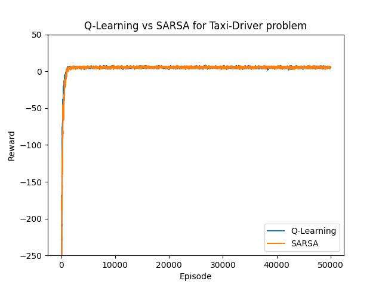
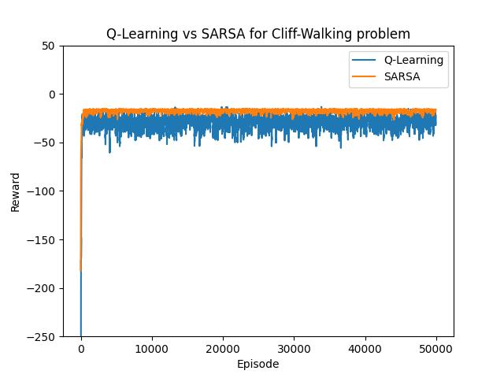
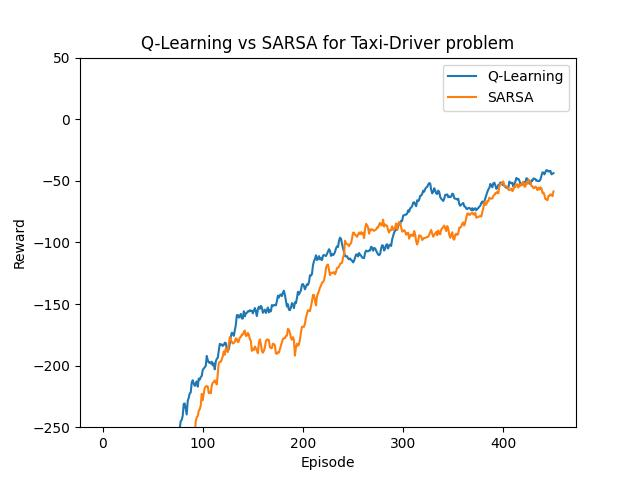
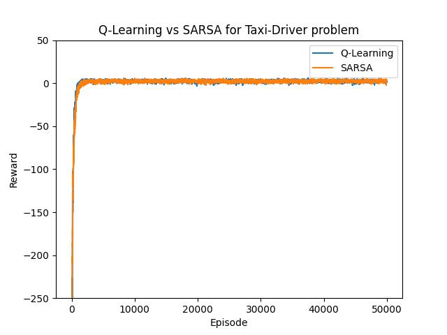
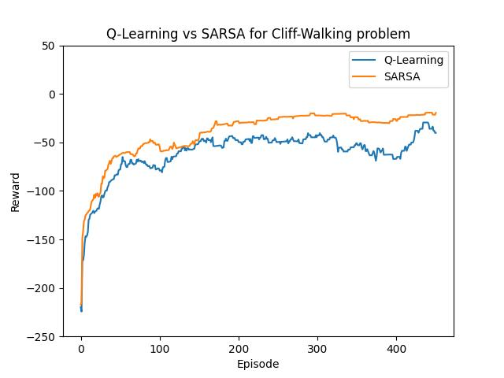

# Q-Learning vs Sarsa

## Questões

1. Qual algoritmo tem os melhores resultados para o ambiente do taxi-driver? A curva de aprendizado dos dois algoritmos é a mesma? O comportamento final do agente, depois de treinado, é ótimo?

    **R:** Ambos os algoritmos apresentam comportamento ótimo depois do treinamento. A curva de aprendizado dos algoritmos, como pode ser observado abaixo, é a mesma, se sobrepondo em quase todo o gráfico.
    
    

    *Gráfico 1: Curva de aprendizado Q-Learning vs Sarsa para problema do Taxi Driver.*

1. Qual algoritmo tem os melhores resultados para o ambiente do Cliff Walking? A curva de aprendizado dos dois algoritmos é a mesma? O comportamento final do agente, depois de treinado, é ótimo? Qual agente tem um comportamento mais conservador e qual tem um comportamento mais otimista?

    **R:** No caso do Cliff Walking, o algoritmo Sarsa demonstrou o melhor resultado, com um comportamento ótimo (caminho mais curto). É perceptível pelo gráfica abaixo que a curva de aprendizado do Sarsa se estabiliza com muito mais facilidade, enquanto o Q-Learning se mostra instável na maioria dos episódios. Esta instabilidade pode ser devida ao comportamento mais conservador deste algoritmo, que leva o agente a caminhar de forma mais distante do penhasco, provavelmente com o objetivo de evitar grandes perdas, mas também sem exagerar no caminho percorrido. Enquanto isso, o Sarsa demonstrou um comportamento mais otimista, levando o agente a percorrer um caminho muito perto da borda do penhasco, mas garantindo uma recompensa maior.

    

    *Gráfico 2: Curva de aprendizado Q-Learning vs Sarsa para problema do Cliff Walking.*

1. Suponha uma seleção de ação gulosa (greedy):

    ```txt
    (
      alpha=0.1, 
      gamma=0.99, 
      epsilon=0.1, 
      epsilon_min=0.1, 
      epsilon_dec=1, 
      episodes=500
    )
    ```
    Qual seria a diferença entre os algoritmos Q-Learning e Sarsa? Os agentes treinados teriam o mesmo comportamento? As curvas de aprendizado também? 

    **R:** Para o problema do Taxi Driver, apenas 500 episódios não se mostram suficientes para treinamento dos modelos, porque eles não convergem, gerando um agente que não é capaz de resolver o problema. No entanto, para um treinamento de 50,000 episódios, os algoritmos conseguem convergir.
    
    Já para o problema do Cliff Walking, ambos os algoritmos convergiram, mas o Sarsa demonstrou novamente um comportamento ótimo, enquanto o Q-Learning apresentou um comportamento ainda mais conservador que antes, realizando um "volta" ainda mais distante da borda do penhasco.

    

    *Gráfico 3: Curva de aprendizado Q-Learning vs Sarsa para problema do Taxi Driver com treinamento de 500 episódios e heurística Greedy.*

    

    *Gráfico 4: Curva de aprendizado Q-Learning vs Sarsa para problema do Taxi Driver com treinamento de 50,000 episódios e heurística Greedy.*

    
    
    *Gráfico 5: Curva de aprendizado Q-Learning vs Sarsa para problema do Cliff Walking com treinamento de 500 episódios e heurística Greedy.*

## Conclusão

### Q-Learning vs Sarsa - Vantagens e Desvantagens 📌️

#### Q-Learning

$Q(S_t, A_t) = Q(S_t, A_t) + \alpha[R_{t+1} + \gamma max(Q(S_{t+1}, a)) - Q(S_t, A_t) ]$

Algorítimo que busca encontrar a melhor ação a ser tomada, dado um estado atual.

É considerao um algoríitmo off-policy, pois a melhor ação é escolhida para a atualização da q_table mesmo que essa ação não seja aplicada nessa ocasião (fator de aleatoriedade na tomada de uma ação - Explore).

Como o QLearning aprende com a "política ótima", ele é considerado um algorítimo mais "agressivo". Ou seja, No exemplo do ambiente CliffWalking o QL seguirá o caminho mais curto, pois esse é o caminho ótimo, mesmo que haja risco maior de queda.

#### Sarsa

$Q(S_t, A_t) = Q(S_t, A_t) + \alpha[R_{t+1} + \gamma Q(S_{t+1}, A_{t+1}) - Q(S_t, A_t) ]$

Como é possível observar pela formula, o algorítimo SARSA aprende com uma política "quase ótima". Um agente treinado com o algorítimo SARSA interage com o ambiente atualizando q_table com base nas ações efetivamente tomadas. Quando o problema envolve achar a solução ótima ou quando o número mínimo de ações deve ser tomada na resolução do problema, o algorítimo SARSA pode não se apresentar como a melhor escolha.

## Basic Usage

```txt
usage: main.py [-h] [--filename BASE_FILENAME] [--data-dir DATA_DIR] [--results-dir RESULTS_DIR] [--train] [--episodes EPISODES]
               [--alpha ALPHA] [--gamma GAMMA] [--epsilon EPSILON] [--epsilon-min EPSILON_MIN] [--epsilon-dec EPSILON_DEC] [--random]
               [--only-exploit]

positional arguments:
  none

options:
  --filename BASE_FILENAME   
                        Identifier to data and results filenames. Default is "taxi-driver".
  --data-dir DATA_DIR   Directory to store the training data. Default is "data". Will be created if not exists.
  --results-dir RESULTS_DIR
                        Directory to store the resulting images (graphs). Default is "results". Will be created if not exists.
  --train               Flag to enable model training. If not set, the model will perform inference using the Q-table.
  --episodes EPISODES   Number of episodes to run during training. Default is 50000.
  --alpha ALPHA         Learning rate for the Q-learning algorithm. Default is 0.1.
  --gamma GAMMA         Discount factor for the Q-learning algorithm. Default is 0.99.
  --epsilon EPSILON     Exploration rate for the Q-learning algorithm. Default is 0.7.
  --epsilon-min EPSILON_MIN
                        Minimum exploration rate. Default is 0.05.
  --epsilon-dec EPSILON_DEC
                        Exploration decay rate. Default is 0.99.
  --random              Randomize all agent actions. Useful for exploring the action space. (Equivalent to "--epsilon 0.0")
  --only-exploit        Only exploit the Q-table for making decisions, without further training. (Equivalent to "--epsilon 1.0")
```

Use these options to configure the behavior of the taxi driver AI model, including training parameters and file paths for input and output data.

## Usage Example

### Training

    python3 main.py --train
    python3 main.py --train --alpha 0.1 --gamma 0.99 --epsilon 0.1 --epsilon-min 0.1 --epsilon-dec 1 --episodes 500 --filename "greedy"

### Running simulation

    python3 main.py
    python3 main.py --filename "greedy"

### Choices

Once running the scripts, you will be prompted some choices. You can choose:

- Between the two environments (1 - Taxi Driver, 2 - Cliff Walking);
- Turn on verbose mode, which will display the environments. (Taxi Driver - Terminal, Cliff Walking - Pygame screen).

# References

[](https://classroom.github.com/a/hAhU4zU3)
